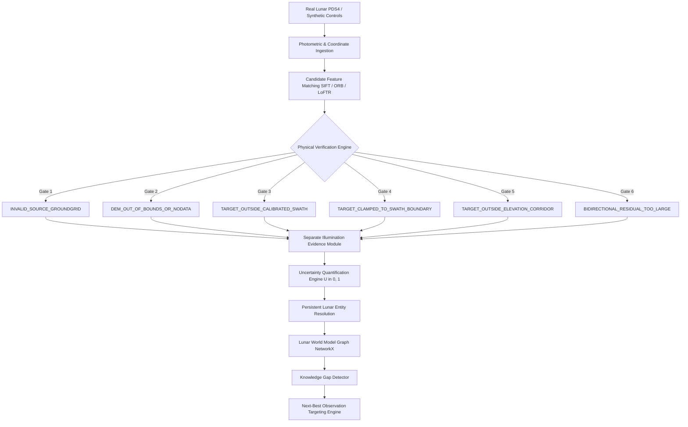

# 🌙 LunarSynapse
### Physics-Aware, Self-Evolving Multi-Modal Lunar World Model

[]()
[](https://fastapi.tiangolo.com)
[](https://react.dev)
[]()
[]()

> **System-Level Novelty Statement:**  
> *"LunarSynapse shifts lunar image correspondence from finding visually similar pixels to building and reasoning over physically validated, uncertainty-aware evidence about persistent lunar entities."*

---

## 🧭 Answers to Fundamental Questions

### 1. What is LunarSynapse?
**LunarSynapse** is an integrated scientific world model and correspondence framework developed for SIH Problem Statement **SIH26166** (*Multi-modal, Sun-angle and Scale Invariant Image Correspondence using Chandrayaan-2 OHRC, TMC-2 and IIRS*). Instead of treating registration as an isolated 2D pixel-alignment task, LunarSynapse anchors multimodal lunar observations into persistent lunar entities, maintains a probabilistic world model, quantifies epistemic uncertainty, detects scientific knowledge gaps, and recommends next-best observations.

### 2. What is novel?
**Novelty is strictly system-level.** Individual algorithms—such as SIFT, ORB, DEM ray-tracing, GroundGrids, knowledge graphs, or Bayesian uncertainty—are well-established in the literature and are **not** claimed as individually novel.  
The core innovation is the **systemic fusion**:
1. Grounding visual feature candidates in a sequence of **six immutable physical gates** derived from flight pushbroom geometry and lunar topography.
2. Decoupling image-to-image registration from persistent entity resolution ($\text{Entity Association} \neq \text{Direct Image Correspondence}$).
3. Closing the active scientific loop by autonomously transforming epistemic knowledge gaps into ranked Next-Best-Observation proposals under the strict epistemic operator `POTENTIALLY_REDUCES_UNCERTAINTY`.

### 3. What is actually demonstrated?
1. **Real Lunar Negative Control (Scenario A):** Visual matchers find 1,489 spurious feature pairs between non-overlapping Chandrayaan-2 OHRC and TMC-2 swaths; the physics verification engine rejects 100% of them at Gate 3 (`TARGET_OUTSIDE_CALIBRATED_SWATH`).
2. **Synthetic Multi-Scale Invariant Control (Scenario B):** Reliable sub-pixel feature recovery across a 20x resolution difference (0.25 m/px vs 5.0 m/px) under controlled synthetic conditions.
3. **Synthetic Sun-Angle Deception Trap (Scenario C):** Visual candidates matching inverted illumination shadows (180° solar azimuth flip) are caught and rejected by the separate illumination evidence module.
4. **Synthetic Hostile Geometric Boundary Control (Scenario D):** Immediate rejection of candidates landing outside the sensor field-of-view swath.
5. **Synthetic Flat Terrain Elevation Degeneracy Control (Scenario E):** Rejection at Gate 5 (`TARGET_OUTSIDE_ELEVATION_CORRIDOR`) when vertical parallax violates DEM bounds.
6. **Active Autonomous Loop:** Identification of open knowledge gaps and formulation of ranked sensor recommendations (IIRS, TMC-2, OHRC).

### 4. What is NOT demonstrated?
- **Real-Data Accuracy:** **`REAL-DATA ACCURACY = N/A`**. No sub-meter independent ground-truth tie points exist on the Moon for arbitrary orbital frames; therefore, claiming a real-data accuracy percentage would be scientifically dishonest.
- **Real-Lunar Physical Correspondence:** **`PHYSICAL CORRESPONDENCE NOT VALIDATED`** for the evaluated real flight pair.
- **Empirical Uncertainty Calibration on Real Flight Data:** **`NOT ESTABLISHED`**.
- **Real-Time Spacecraft Tasking:** Recommendations are **decision-support proposals**, not automated telecommand uploads.
- **Production Cloud Deployment:** Only local multi-process execution has been validated.

### 5. How do I run it?
See the [Quick Start Guide](#-quick-start-guide) below.

### 6. How do I reproduce the demonstrations?
From the UI or CLI:
- Run the full suite via `pytest outgraph/tests/test_phase8_6_reliability.py outgraph/tests/test_phase8_7_reproducibility.py -v`.
- In the frontend, navigate to **Scenarios Lab** (`/scenarios`), select any Scenario (A through E), click **Run / Inspect**, and open the **Scientific Explainability Modal** to view the complete reasoning trace and judge card.

### 7. Which data are real?
- **OHRC Image & XML Label:** `data/real/ch2_ohr_ncp_20210115t084420353_d_img_d18.xml` and `.img` (Chandrayaan-2 flight product, ~0.25 m GSD).
- **TMC-2 Image & XML Label:** `data/real/ch2_tmc_ncn_20200318t1349141011_d_img_d18.xml` and `.img` (Chandrayaan-2 flight product, ~5.0 m GSD).
- **Topographic Reference:** SLDEM2015 elevation dataset / LOLA lunar reference datum.
- *Integrity:* `data/real/` has **0 bytes modified** throughout all phases.

### 8. Which data are synthetic?
- **Scenarios B, C, D, and E:** Procedurally generated synthetic lunar terrain, calibrated to physical lunar crater morphology, optical reflectance, and simulated solar angles. All synthetic scenarios are unambiguously tagged with `is_synthetic: true` and provenance `SYNTHETIC`.

### 9. Why can visual similarity be rejected?
Visual matchers evaluate local pixel gradients (e.g. SIFT/ORB descriptors). On the lunar surface, repetitive crater shapes, scale differences, and contrasting illumination shadows frequently create high visual similarity between features that are physically miles apart. Visual similarity is merely a candidate hypothesis; physical verification decides validity.

### 10. How does physical verification work?
Candidates must pass through **six immutable physical gates**:
- **Gate 1:** `INVALID_SOURCE_GROUNDGRID` (Verifies pushbroom flight grid coordinates)
- **Gate 2:** `DEM_OUT_OF_BOUNDS_OR_NODATA` (Verifies SLDEM2015 elevation corridor validity)
- **Gate 3:** `TARGET_OUTSIDE_CALIBRATED_SWATH` (Verifies target ray falls inside sensor swath)
- **Gate 4:** `TARGET_CLAMPED_TO_SWATH_BOUNDARY` (Catches boundary clamping artifacts)
- **Gate 5:** `TARGET_OUTSIDE_ELEVATION_CORRIDOR` (Verifies vertical parallax bounds)
- **Gate 6:** `BIDIRECTIONAL_RESIDUAL_TOO_LARGE` (Verifies ray-casting bidirectional consistency)
- *Note:* **Illumination verification is NOT Gate 5**. Illumination is evaluated as a separate multi-dimensional evidence module (Phase 6.2).

### 11. What is the world model?
A persistent graph representation linking identified **Lunar Entities** (`LUNAR-ENTITY-XXX`) with multi-temporal observations, instrument provenance, physical verification evidence, and belief hypotheses (morphology, elevation, spectral profile).

### 12. What are knowledge gaps?
Explicit mathematical statements of missing or uncertain scientific evidence for a lunar entity (e.g. `MISSING_SPECTRAL_EVIDENCE`, `HIGH_ILLUMINATION_UNCERTAINTY`, `UNCERTAINTY_TOO_HIGH`).

### 13. What does next-best observation mean?
A quantitatively ranked recommendation specifying which sensor (e.g. IIRS for spectral data, OHRC for fine morphology), what solar geometry, and what spatial resolution would maximize **Expected Information Gain (EIG)** under the epistemic operator `POTENTIALLY_REDUCES_UNCERTAINTY`.

### 14. What are the scientific limitations?
See the [Central Scientific Claim Ledger](docs/CLAIM_LEDGER.md). All disclaimers are preserved without exception.

---

## ⚡ Quick Start Guide

### Prerequisites
- **Python 3.11 to 3.13** (Windows win32 validated)
- **Node.js 18+** and **npm**
- **Git**

### 1. Installation

```bash
# Clone repository
git clone https://github.com/DeviPrasath2004/SIH26166.git
cd SIH26166

# Setup Python Virtual Environment
python -m venv .venv
# Windows PowerShell:
.venv\Scripts\Activate.ps1
# Install dependencies
pip install -r outgraph/requirements.txt

# Setup Frontend
cd outgraph/frontend
npm install
cd ../..
```

### 2. Running Backend and Frontend

```bash
# Terminal 1: Launch FastAPI Backend (Port 8000)
# From repository root:
python -m uvicorn outgraph.backend.app.main:app --host 127.0.0.1 --port 8000 --reload

# Terminal 2: Launch React / Vite Frontend (Port 5173)
cd outgraph/frontend
npm run dev
```

Open your browser at: `http://localhost:5173`

### 3. Running Test Suites

```bash
# Run Phase 8.6 Reliability Suite (17 tests)
pytest outgraph/tests/test_phase8_6_reliability.py -v

# Run Phase 8.7 Reproducibility Suite (17 tests)
pytest outgraph/tests/test_phase8_7_reproducibility.py -v

# Run Complete Regression Suite (375 tests)
pytest outgraph/tests/ -v

# Run Frontend Production Build
cd outgraph/frontend
npm run build
```

---

## 🏛️ End-to-End Pipeline Architecture



---

## 📦 Large Data Boundary & Deployment Architecture

```
FRONTEND (React SPA)
    ↓ (Bounded JSON, Previews, Thumbnails < 250 KB)
FASTAPI BACKEND
    ↓ (Local In-Memory / IPC)
SCIENTIFIC WORKER (Local Execution Volume)
    ↓ (Memory-Mapped Windowed Reads)
LOCAL DATA STORAGE (`data/real/` - Multi-GB PDS4 Products)
```

> [!WARNING]
> **DEPLOYMENT ARCHITECTURE DOCUMENTED — PRODUCTION DEPLOYMENT NOT VALIDATED**  
> Raw multi-GB PDS4 binaries must **never** be bundled into serverless functions or web assets.

---

## ⚖️ Scientific Integrity & Prohibited Language

In compliance with Phase 8 scientific standards:
- Strictly forbidden terms (`100% accurate`, `perfect`, `guaranteed`, `confirmed lunar match`, `universally invariant`, `WILL_RESOLVE`, `real-time spacecraft tasking`) are barred.
- The epistemic operator is exclusively **`POTENTIALLY_REDUCES_UNCERTAINTY`**.
- Real-data accuracy is honestly stated as **`N/A`**.
- Physical correspondence on evaluated real data is honestly stated as **`NOT VALIDATED`**.
