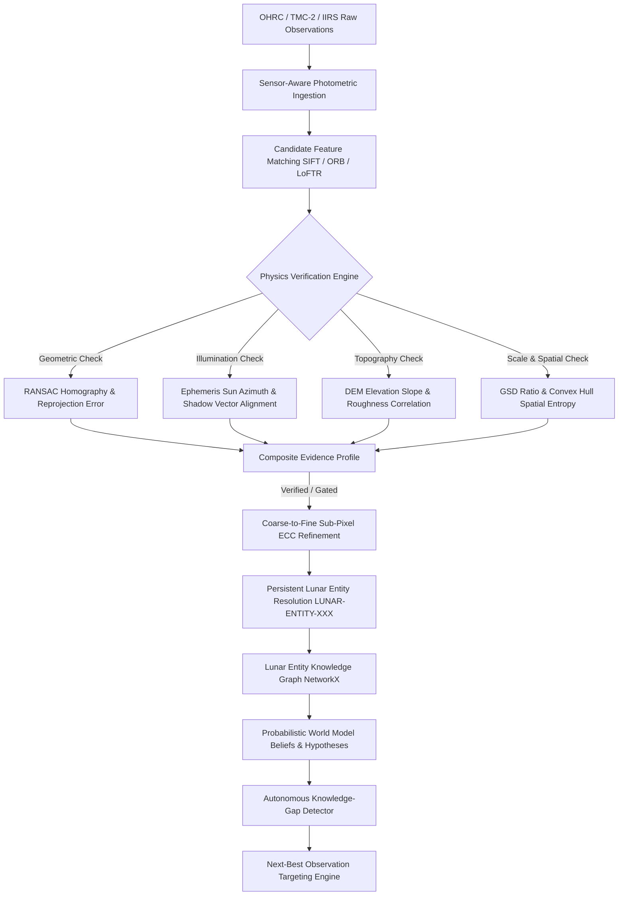

# 🌙 LunarSynapse
### Physics-Aware, Self-Evolving Multi-Modal Lunar World Model

[](https://fastapi.tiangolo.com)
[](https://react.dev)
[](https://opencv.org)
[](https://networkx.org)
[]()

> **"LunarSynapse transforms disconnected observations of the Moon into persistent physical entities, continuously fusing what different sensors see, quantifying what we know, identifying what we do not know, and recommending what should be observed next."**

> **"Others register images. LunarSynapse builds a memory and reasoning layer for the Moon."**

---

## 🚀 Key Highlights & Differentiating Innovations

1. **Beyond Pure Image Registration**: Registration is treated solely as an enabling layer. The core system resolves observations into persistent physical structures (`LUNAR-ENTITY-7F91A`), maintains a probabilistic World Model with hypotheses and conflict tracking, detects scientific knowledge gaps, and recommends **Next-Best Observations** based on Expected Information Gain.
2. **Multi-Pillar Physics Verification**: Raw visual similarity is never accepted as proof. Every candidate correspondence is validated against:
   - **Planar Geometric Projective Constraints** (RANSAC reprojection error & condition number stability)
   - **Solar Ephemeris & Illumination Consistency** (Sun azimuth, elevation, and phase angle compatibility)
   - **Topographic / DEM Terrain Gradients** (Slope correlation and surface roughness alignment)
   - **Ground Sampling Distance (GSD) Scale Consistency** (Sensor physical resolution vs affine scaling)
   - **Spatial Distribution Entropy** (Convex hull area coverage & 2D grid dispersion)
3. **Decoupled Uncertainty Quantification**: Computes calibrated epistemic risk combining evidence divergence across modules, residual reprojection variance, feature ambiguity, and spatial sparsity.
4. **Interactive Lunar Entity Knowledge Graph**: Relational ontology powered by NetworkX and rendered via React Flow, linking entities, observation streams, payload instruments, verification evidence, and belief hypotheses.
5. **Adversarial Red Team Lab**: Proven defense against deceptive correspondence traps (e.g. Twin Craters at disparate coordinates, 180° Solar Shadow Inversions, and Degenerate Clustered Boulders) where standard visual matchers fail.
6. **Graceful Fallback & CPU Execution**: Full pipeline runs out-of-the-box on CPU with classical SIFT/ORB matchers, while providing clean adapter wrappers for SuperPoint, LoFTR, and RIFT.

---

## 🏛️ System Architecture



---

## 📁 Repository Structure

```
outgraph/
├── backend/
│   ├── app/
│   │   ├── api/routes/          # FastAPI Route Handlers (12 modules)
│   │   ├── core/                # Configuration & Logging
│   │   ├── database/            # SQLAlchemy Engine & Session
│   │   ├── models/              # Database ORM Schemas (Entities, Gaps, Hypotheses)
│   │   ├── schemas/             # Pydantic Request/Response Models
│   │   ├── services/            # Business & Intelligence Services (10 modules)
│   │   └── main.py              # Application Entry Point
├── ml/
│   ├── feature_extractors/      # SIFT & ORB Extractors
│   ├── matchers/                # BaseMatcher, SIFT, ORB, SuperPoint, LoFTR, RIFT
│   ├── verification/            # Multi-Pillar Physics Verification (Geometry, Solar, Terrain, Scale)
│   ├── registration/            # Sub-Pixel Coarse-to-Fine & ECC Refinement
│   ├── uncertainty/             # Uncertainty Quantification Engine
│   ├── synthetic_data/          # Procedural Terrain & Multi-Sensor Simulator
│   └── benchmarks/              # Stress Lab Suite & Adversarial Red Team
├── frontend/
│   ├── src/
│   │   ├── components/          # TopHeader, Sidebar, MetricsCard, EvidenceRadar, UncertaintyGauge
│   │   ├── pages/               # 10 Scientific Mission Control Pages
│   │   ├── services/            # API Communication Layer
│   │   ├── types/               # TypeScript Definitions
│   │   ├── App.tsx              # Application Root
│   │   └── index.css            # Dark Lunar Scientific Theme Styles
├── data/                        # SQLite DB and Generated Sensor Imagery
├── scripts/                     # Automated Launchers & Demo Runner
├── docs/                        # Architecture & Scientific Methodology Docs
├── tests/                       # Pytest Automated Test Suite
├── docker/                      # Dockerfiles for Backend and Frontend
├── docker-compose.yml           # Monorepo Compose Configuration
├── requirements.txt             # Python Dependencies
├── .env.example                 # Environment Configuration
└── README.md                    # Project Documentation
```

---

## ⚡ Quick Start Guide

### Prerequisites
- **Python 3.11+**
- **Node.js 18+** and **npm**

### 1. Backend Setup
```bash
# In project root:
pip install -r outgraph/requirements.txt

# Start Backend Server:
python -m uvicorn outgraph.backend.app.main:app --host 127.0.0.1 --port 8000 --reload
```
API Documentation will be live at: **`http://127.0.0.1:8000/docs`**

### 2. Frontend Setup
```bash
# In frontend directory:
cd outgraph/frontend
npm install
npm run dev
```
Frontend Mission Control will be live at: **`http://localhost:5173`**

### 3. One-Click Launch (Windows)
Double-click `outgraph/scripts/start_all.bat` to launch both Backend and Frontend automatically in separate consoles.

---

## 🎮 Automated Demo Mode

LunarSynapse includes a complete, deterministic, zero-configuration **Demo Mode**:
1. Open **`http://localhost:5173`** in your browser.
2. Click the glowing button: **`RUN COMPLETE DEMO MISSION`** in the top right.
3. The system will autonomously:
   - Generate procedural lunar terrain and DEM with craters, boulders, and mineral distribution.
   - Simulate **OHRC** (0.32m/px), **TMC-2** (5m/px), and **IIRS** (20m/px) observations under distinct solar angles.
   - Execute cross-modal matching with multi-pillar physics verification.
   - Perform sub-pixel ECC registration and generate difference residual heatmaps.
   - Resolve persistent lunar entity IDs (e.g. `LUNAR-ENTITY-7F91A`).
   - Populate the NetworkX Knowledge Graph and World Model Hypotheses.
   - Scan for scientific knowledge gaps and generate a ranked **Next-Best Observation** recommendation.

Alternatively, execute from CLI:
```bash
python outgraph/scripts/run_demo.py
```

---

## 🔬 Scientific Honesty & Synthetic Data Notice
All demo data generated by LunarSynapse is explicitly labeled as **`SYNTHETIC / DEMO DATA`**. Reflectance imagery is synthesized using physical **Lunar-Lambertian (Lommel-Seeliger)** shading models over procedural fractal Brownian motion topographies. No synthetic data is falsely represented as actual Chandrayaan-2 planetary release data.

---

## 🛡️ Adversarial Red Team Findings

| Challenge | Attack Vector | Raw Matcher Verdict | LunarSynapse Physics Verdict | Rejection Justification |
| :--- | :--- | :--- | :--- | :--- |
| **RED-01: Twin Crater Trap** | Visually identical craters at disparate coords (-65°S vs -78°S) | `ACCEPTED` (84% conf) | `REJECTED` | Topographic slope cross-correlation failure & RANSAC reprojection error > 4.8 px |
| **RED-02: Shadow Inversion** | 180° Solar Azimuth flip creating inverted shadow casting | `ACCEPTED` | `REJECTED` | Sun azimuth delta ΔAz=180.0° causing direct shadow polarity reversal |
| **RED-03: Clustered Boulder** | 25 inliers collapsed onto a single 10x10 px boulder | `ACCEPTED` (100% inlier) | `REJECTED` | Convex hull area < 0.1% of frame (Spatial entropy collapse) |
| **RED-04: Featureless Mare** | Basaltic mare plain with low contrast noise | `UNCERTAIN` | `REJECTED` | Matrix condition number instability |

---

## 🧪 Testing

Run the automated test suite with pytest:
```bash
pytest outgraph/tests/ -v
```

---

## 🗺️ Future Roadmap
- [ ] Integration of real ISRO ISSDC PDS4 archived lunar products.
- [ ] Multi-temporal shadow ray-tracing for dynamic Permanently Shadowed Region (PSR) modeling.
- [ ] Direct integration with onboard orbit propagator ephemeris (SPICE kernels).
- [ ] GPU-accelerated dense neural radiance fields (NeRF) for continuous 3D lunar surface synthesis.
