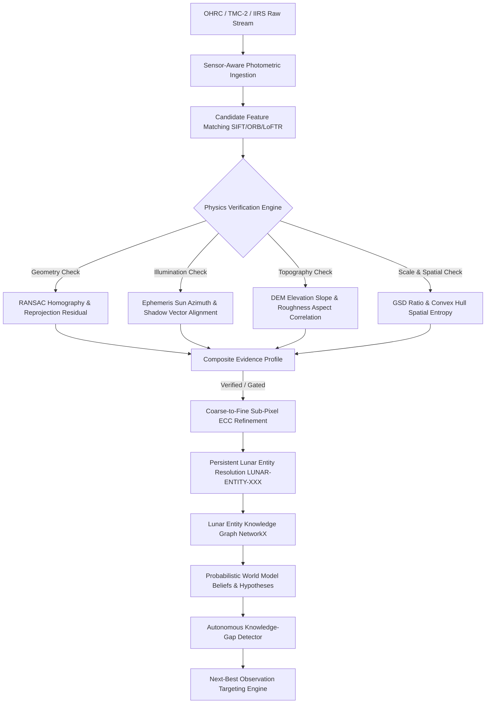

# LunarSynapse Architecture Overview

## 1. Executive Summary
**LunarSynapse** is an AI-driven, physics-grounded planetary intelligence platform. Unlike traditional remote sensing pipelines that treat multi-modal imagery solely as pixel grids for pairwise 2D registration, LunarSynapse treats observations as sensor-dependent projections of persistent 3D physical entities on the Moon.

---

## 2. Core Subsystems

### A. Physics-Aware Correspondence Engine
Traditional image matchers fail under lunar polar lighting conditions due to extreme shadow elongations, high crater circular symmetry, and multi-resolution scale jumps. LunarSynapse introduces a multi-pillar gating mechanism:
1. **Geometric Consistency**: Computes planar projective homography residuals and condition number stability.
2. **Illumination Consistency**: Validates solar azimuth and elevation deltas, ensuring edge gradients do not represent shadow inversion traps.
3. **Topographic Consistency**: Cross-references local digital elevation model (DEM) gradients and roughness.
4. **Scale & Spatial Distribution**: Evaluates Ground Sampling Distance (GSD) ratios and penalizes degenerate keypoint clusters via spatial entropy.

### B. Uncertainty Quantification Subsystem
Quantifies composite epistemic risk by computing:
- **Evidence Divergence**: Variance across the 6 physical evidence modules.
- **Geometric Instability**: Reprojection error standard deviation and matrix condition numbers.
- **Feature Ambiguity**: Descriptor ratio distribution entropy.
- **Spatial Sparsity**: Convex hull area penalty.

### C. Persistent Lunar Entity Identity & World Model
Assigns unique canonical identifiers (`LUNAR-ENTITY-7F91A`) to physical lunar structures. Incoming observations are resolved and attached to existing entities across time, preserving conflicting scientific hypotheses without data overwriting.

### D. Next-Best Observation (NBO) Recommendation Engine
Optimizes observation targeting via quantitative expected information gain:
$$\mathbb{E}[\Delta I] = U \times R \times M \times Q \times F$$
- $U$: Current epistemic uncertainty
- $R$: Sensor payload relevance
- $M$: Missing information factor
- $Q$: Measurement signal-to-noise quality
- $F$: Spacecraft trajectory feasibility
